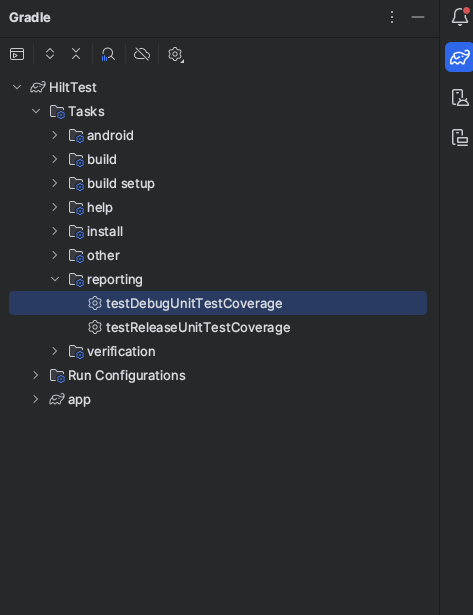
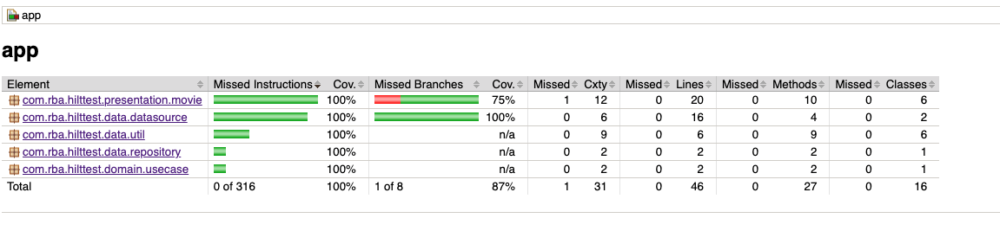

# Movies List

Example Project using Clean Architecture, Retrofit, Hilt, Mockk and Jacoco (100% coverage).

## Coverage

Use **testDebugUnitTestCoverage**



```bash
./gradlew :app:testDebugUnitTestCoverage
```



## Contributing

Pull requests are welcome. For major changes, please open an issue first
to discuss what you would like to change.

Please make sure to update tests as appropriate.

<br><br>
*Happy coding!*