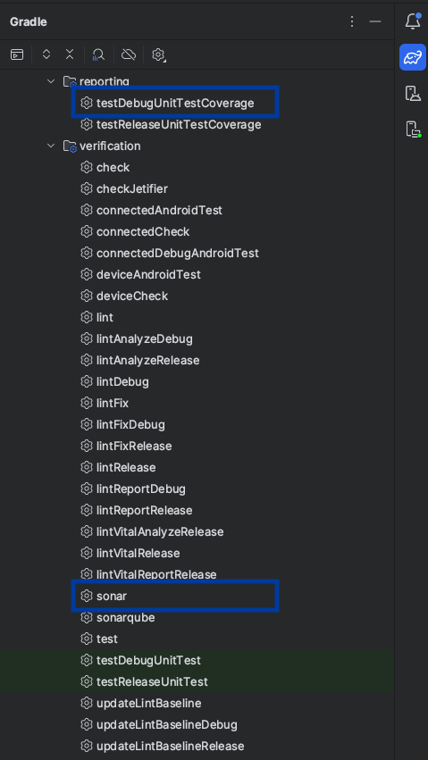
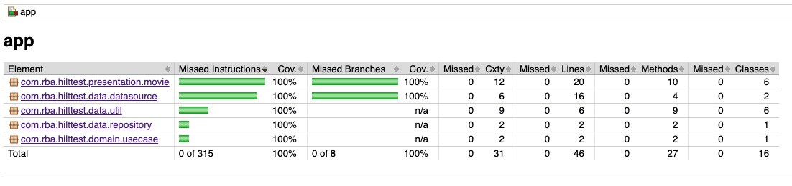

# Movies List

Example Project using Clean Architecture, Retrofit, Hilt, Mockk, Jacoco and SonarQube (100% coverage).

## Coverage with Jacoco and SonarQube

For Jacoco Use **testDebugUnitTestCoverage** and SonarQube **sonar**



```bash
//Jacoco
./gradlew :app:testDebugUnitTestCoverage

//Sonar
./gradlew :app:sonar
```




## Update SonarQube credentials

```bash
// devops/sonar.gradle
sonar.projectName
sonar.projectKey
sonar.host.url
sonar.login
```
>sonar api key is located in **gradle.properties**


## Contributing

Pull requests are welcome. For major changes, please open an issue first
to discuss what you would like to change.

Please make sure to update tests as appropriate.

<br><br>
*Happy coding!*